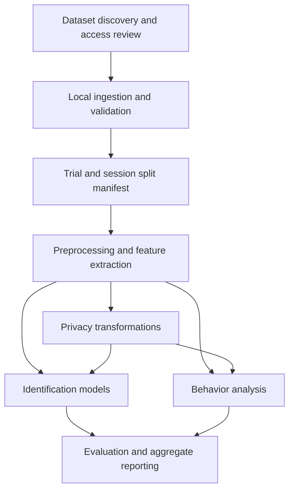

# Privacy/Behavior Analysis in Mixed Reality

**Team:** Ethan  O'Connor and Avaneesh Mallela 

**Timeline:** ~8 weeks from the agreed project start:
 
2 weeks for research, 
5 weeks for finding datasets that match requirements and performing analysis on them (based on literature), 
1 week for polishing 

## Motivation
Head mounted mixed-reality devices overlay interactive 3D content onto physical surroundings. The sensors present on these devices can capture body motion, eye gaze, hand joints, and facial expression. Even without names or account identifiers, tracking signals can expose unique, user-identifiable behavior. Understanding these risks can help identify which signals are useful for interaction and which expose identity, some of which may not be mutually exclusive.

## Goals
Find relevant existing pose, gaze, and gesture datasets, preprocess them, and perform privacy and behavior analysis informed by existing literature.

- Evaluate identification risk and observable behavior using documented experiments.
- Collect datasets with unique participant IDs and trial/session boundaries (i.e., datasets that are based on individual tasks).
- Prevent training dataset from leaking into the testing dataset, and quantify uncertainty.
- Compare sensor subsets and privacy transformations against behavior utility.
- Distinguish evidence from VR datasets from conclusions about MR. VR and MR are very different, one creates the environment while the other adapts to it.

## Deliverables
| Deliverable                             | Completion criterion |
| --------------------------------------- | --------------------------------------------------------------------------------- |
| Dataset catalog                         | Pose, gaze, and gesture candidates documented with labels and limitations         |
| Preprocessing specs, and implementation | Schema, validation rules, reproducible config                                     |
| Privacy analysis                        | Identification evaluation, sensor ablations, and transformation comparisons       |
| Behavior analysis               | At least one supported behavior task or exploratory analysis, with appropriate validation |
| Final report and presentation   | Methods, aggregate figures, literature comparison, limitations, and contributions         |
| (Optional) Unity visualization  | Offline replay of permitted trajectories using Unity                                      |

This repo contains proposal docs. Code, dependencies, Unity assets/setup, datasets, and final results will be delivered in the future.

## System blocks

## Team lead roles
| Member   | Lead roles                           | Primary responsibilities                                                                                    |
| -------- | ------------------------------------ | ----------------------------------------------------------------------------------------------------------- |
| Ethan    | Setup, writing, research, networking | Project organization, timeline tracking, report/presentation creation, dataset transfer and access workflow |
| Avaneesh | Research; algorithm design           | Literature and dataset review, features, models, split protocol, evaluation design                          |

Shared responsibilities: software/python pipeline, optional Unity replay, reviewing methods and results

Networking implies secure handling of the dataset and collaboration workflow, in case data sets do contain real PII

## Hardware and software
Hardware: Windows computer/laptop, Git, Python. ~16 GB RAM, GPU/CPU, and enough hard drive space for datasets. 

Software: Python libraries planned for dataset analysis: NumPy, pandas, SciPy, Matplotlib. 

If we have time, Unity is planned for offline visualization.

## Project documents
- [Analysis and system requirements](docs/ANALYSIS_PLAN.md)
- [Dataset catalog](docs/DATASETS.md)
- [Team responsibilities](docs/TEAM.md)
- [Eight-week timeline](docs/TIMELINE.md)
- [References](docs/REFERENCES.md)
